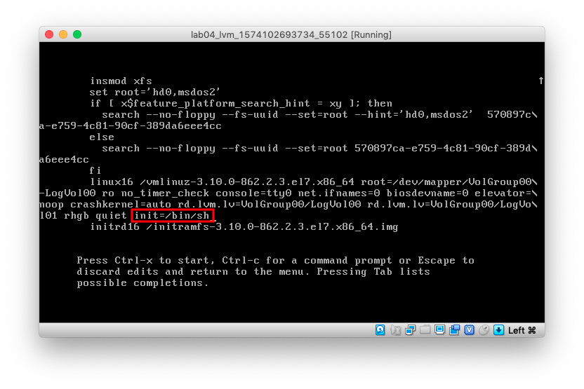
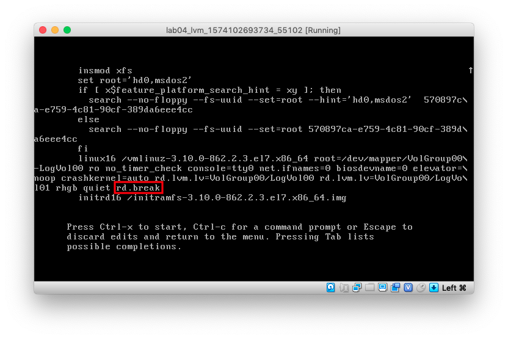
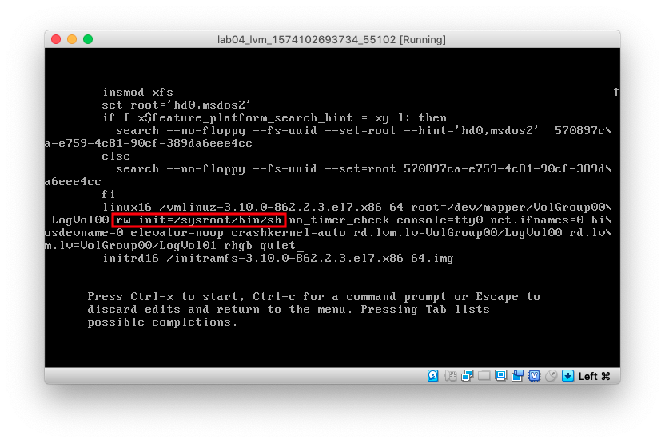

# Сброс пароля для Centos 7

> [!NOTE]
> Инструкция не работает для Vagrant box

## Способ 1: Замена init на шел

Указываем загрузчику вместо процесса **/sbin/init** запусть шел **/bin/sh** получая доступ к файловой системе root. Перемонтируем систему на Read/Write и меняем пароль root не забывая о SELinux.

1. При загрузке системы ждем появления меню выбора ядра с которого заргружается система и нажимаем клафишу **e** для редактирования меню. 
2. Находим строчку начинающаюся с **linux16** и в конце добавляем **init=/bin/sh**.
> Для Vagrant box требуется так же удалить строчку **console=ttyS0,115200n8**


3. Нажимаем **CTRL-X** для продолжения загрузки.
4. Перемонтируем файловую систему в режим Read/Write:
```
mount -o remount,rw /
```
5. Меняем пароль root
```
passwd root
```
6. Указываем SELinux перемаркировать все файлы при следующей перезагрузке
```
touch /.autorelabel
```
7. Перезагружаем систему вызовом процесса init с указанием к перезугрузке

```
exec /sbin/init 6
```

### Способ 2: Emergency shell

Прерывание загрузки в момент когда **initrd** уже подмонтировало файловую систему root в **/sysroot** и следующим шагом должен быть вызов **pivot_root()** для монтирования файловой системы root и дальнейшей загрузки системы. Перемонтируем **/sysroot** в режим Read/Write, переключаем **/** на **/sysroot**, меняем пароль root не забывая о SELinux.

1. При загрузке системы ждем появления меню выбора ядра с которого заргружается система и нажимаем клафишу **e** для редактирования меню. 
2. Находим строчку начинающаюся с **linux16** и в конце добавляем **rd.break**.
> Для Vagrant box требуется так же удалить строчку **console=ttyS0,115200n8**


3. Нажимаем **CTRL-X** для продолжения загрузки.
4. Перемонтируем файловую систему в режим Read/Write:
```
mount -o remount,rw /sysroot
```
5. Подменяем раздел root
```
chroot /sysroot
```
6. Указываем SELinux перемаркировать все файлы при следующей перезагрузке
```
touch /.autorelabel
```
7. Два раза набираем **exit** для выхода из chroot и перезагрузки системы
```
exit
exit
```

### Способ 3: Single user more

Попадаем в **single user mode** с смонтированной файловой системой root в **/sysroot**. Перемонтируем **/sysroot** в режим Read/Write, переключаем **/** на **/sysroot**, меняем пароль root не забывая о SELinux.

1. При загрузке системы ждемы появления меню выбора ядра с которого заргружается система и нажимаем клафишу **e** для редактирования меню. 
2. Находим строчку начинающаюся с **linux16** и в этой сроке находим слово **ro**, которое меняем на **rw init=/sysroot/bin/sh**.
> Для Vagrant box требуется так же удалить строчку **console=ttyS0,115200n8**


3. Нажимаем **CTRL-X** для продолжения загрузки.
4. Подменяем раздел root
```
chroot /sysroot
```
5. Указываем SELinux перемаркировать все файлы при следующей перезагрузке
```
touch /.autorelabel
```
6. Выходим из chroot
```
exit
```
7. Перезагружаем систему

```
reboot
```